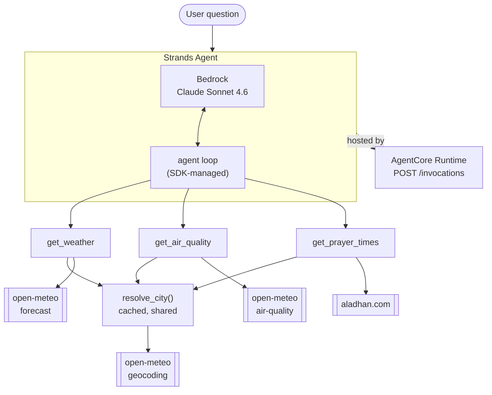

# Give your AI hands

A Karachi city agent built with the [Strands Agents SDK](https://strandsagents.com) and deployable to [Amazon Bedrock AgentCore Runtime](https://docs.aws.amazon.com/bedrock-agentcore/).

A language model knows a lot and can do nothing. It cannot tell you the temperature outside, whether the air is safe for a child with asthma, or how long until Maghrib. Give it three small Python functions and it answers all three at once:

```text
> Can I take the kids to Seaview after Maghrib?
```

That is three live API calls, a timezone, and a judgement call. The model plans it, the tools supply the facts.

## The tools

| Tool | Source | Answers |
| --- | --- | --- |
| `get_weather(city)` | [open-meteo](https://open-meteo.com) | temperature, feels-like, humidity, wind, rain now |
| `get_air_quality(city)` | [open-meteo](https://open-meteo.com) | US AQI, category, what to do about it |
| `get_prayer_times(city)` | [aladhan.com](https://aladhan.com) | the five prayers, sunrise/sunset, next prayer, local clock |

All three are keyless, so there is no secret in this repo and none on the machine that runs it.

## Quickstart

Needs AWS credentials with Bedrock access to `global.anthropic.claude-sonnet-4-6`. Python and the venv are handled by uv.

```bash
make install
make run Q="how's the air in Karachi right now?"
make repl
```

Useful:

```bash
make tools                                  # the JSON schema Strands generated from the Python
uv run karachi-agent --trace "when is Maghrib?"
uv run karachi-agent --debug "..."          # HTTP timings and SDK internals
```

Run `make tools` once. Nobody wrote a tool schema by hand here; every one is derived from a type hint and a docstring.

## Architecture



No orchestration graph and no router. The model decides which tools to call and when it has enough to answer.

## Design notes

The interesting part of an agent is not the model call, it is the tool layer.

- **The docstring is the API.** Strands turns each signature and docstring into the schema the model sees, so the docstring is production code.
- **Shape the payload.** open-meteo returns eight pollutants; we return the two that matter plus a category and one line of guidance. You pay for every token, on every turn.
- **Encode what you can encode.** What US AQI 165 means is a published table, so it lives in `tools/scales.py`, not in the prompt.
- **Tools return failures, they do not raise.** Every tool returns `{"ok": false, "error": {...}}` with a `kind` and a `retryable` flag, so the model can answer the half that worked and say which half is missing.
- **Tell the model what time it is.** It has no clock. `get_prayer_times` returns `local_time`, which is the difference between "how long until Maghrib" being answered and being invented.
- **One resolver, cached.** No upstream API takes a city name we can trust, so there is one `resolve_city()`, cached, carrying the IANA timezone. It falls back to built-in coordinates for Karachi, Lahore and Islamabad when geocoding itself is down.

## Deploy to AgentCore Runtime

`runtime.py` implements the runtime's HTTP contract in about ten lines. Check it locally first:

```bash
make serve
curl -s localhost:8080/invocations -H 'content-type: application/json' -d '{"prompt": "when is Maghrib in Karachi?"}'
```

Then `make deploy`.

## Development

```bash
make help
make check     # ruff + mypy
make fmt
```

## Layout

```text
src/karachi_agent/
  agent.py        assembly: model + prompt + tools
  prompts.py      the system prompt
  config.py       env-resolved settings
  geo.py          city -> coordinates resolver
  http.py         one pooled, timeout-bounded client
  errors.py       the tool failure contract
  cli.py          local driver
  runtime.py      AgentCore Runtime entrypoint
  tools/          weather, air_quality, prayer_times, scales
docs/
  TALK.md         stage runbook
```

## Talk

Built for an AWS User Group talk on Strands and Bedrock AgentCore. Demo script in [docs/TALK.md](docs/TALK.md).

## License

MIT. See [LICENSE](LICENSE).
